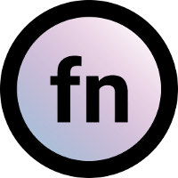

# [OpenFn Documentation & Issue Tracking](https://docs.openfn.org)

## [&nbsp;&nbsp;docs.openfn.org](https://docs.openfn.org)

**_To view the documentation please visit
[docs.openfn.org](https://docs.openfn.org)._**

#### Other documentation

Documentation for various OpenFn tools, such as
[openfn/devtools](https://openfn.github.io/devtools/),
[openfn/core](https://github.com/OpenFn/core), and all of our open-source
language packages can be found in
[OpenFn's Github organization](https://github.com/OpenFn).

This repository is used to maintain the docs site, and for users to submit
issues and feature requests.

#### Contributing to this documentation site

Visit https://docs.openfn.org/docs/style-guide.

This website is built using [Docusaurus 2](https://v2.docusaurus.io/), a modern
static website generator.

- To create new docs pages, add markdown files (or JS files) to the `/docs`
  folder.
- To view those new pages via the navigation, add links to them in the header,
  footer, or sidebars.
- Note that page ids (which are required in `sidebar.js` are _either_ set
  explicitly _or_ automatically generated by docusaurus as the filename, sans
  extension.)

```sh
./sidebars.js
./sidebars-library.js
./docusaurs.config.js
```

#####

Installation

```console
yarn install
```

##### Local Development

```console
npm run start
```

This command starts a local development server and open up a browser window.
Most changes are reflected live without having to restart the server.

##### Build and serve for full-featured testing

```console
npm run build
npm run serve
```

This command generates static content into the `build` directory and can be
served using any static contents hosting service.

##### Deployment

Builds to `main` will autodeploy.
