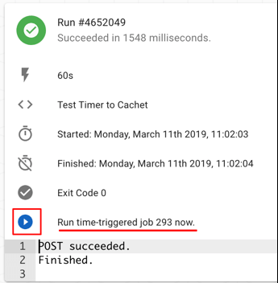
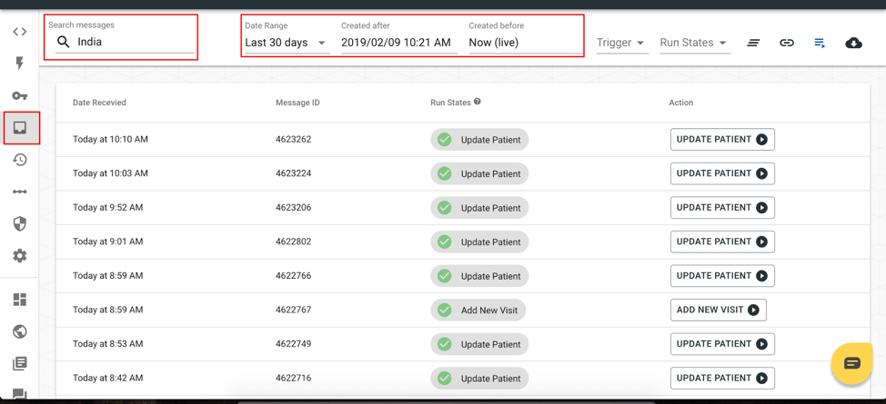
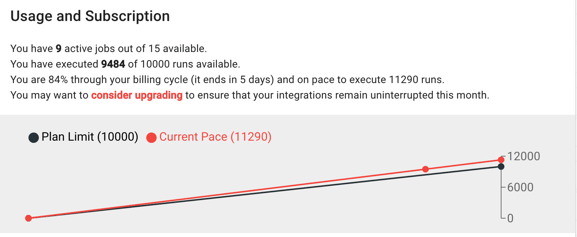
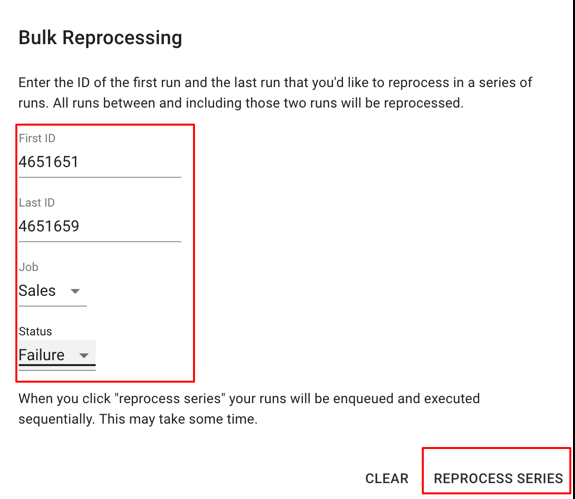

## Connecting Source Applications

Most modern web applications have a feature that allows you to `push`,
`publish`, or `post` data to another URL when a certain **event** takes place.
This event could be a form submission, mobile payment, patient registration, or
barcode scan submission from a mobile app. The key is that your source
application will notify OpenFn when _something happens_.

1. Go to the "settings" or "administration" page for your source app, and look
   for a `Webhook API`, `Data Forwarding API`, or `Notifications API`. Write to
   the developers of your application if none is provided out of the box.

2. When setting up forwarding, select to send messages in `JSON` to your
   project's `inbox URL`. This is a UUID that serves as your API token. You can
   find and copy your secure inbox URL by clicking on the "copy URL" link in the
   bottom-right corner of the project in question on your
   **[project dashboard](https://www.openfn.org/projects)** page or by using the
   "Copy URL" button on your project's "Inbox" page.

3. Soon you'll see new messages arrive in your **Inbox**.

See [Connecting Data Sources](https://docs.openfn.org/source-apps.html) for specific
instructions for connecting common applications.

### Inbox Security

OpenFn project administrators can choose to configure additional authentication
for any inbound requests made to the project's inbox URL. In the "Access &
Security" page of their OpenFn project, Administrators can choose from API Key
and Basic Auth types, which will prompt administrators to either generate an API
token or to setup a username:password credential. Once this inbox authentication
is configured, any HTTP requests made to the OpenFn Inbox URL must include
either this token or username:password in the request header. 

#### Rotating auth methods

Because more than one auth method may be accepted at a given time, some
organizations choose to periodically rotate their auth methods for extra
security and can do so without disrupting live production integrations. To
rotate your inbox auth methods:

1. Create a _second_ valid auth method with a new token or user:pass combination.
2. Provide that token to your external systems so that they can start using it
   in their webhooks/requests to OpenFn.
3. Once you are certain that all external services are now using the new auth
   token, _revoke_ the old auth token.

You can repeat this process as frequently as is required by your organization's
internal security protocols.

## Creating a compatible notifications service

If you are a developer, looking to set up a compatible notifications API for
OpenFn, please see our
[Application Developers](https://docs.openfn.org/for-devs.html) section.

<!-- (Copied to build/triggers -->
## Triggers

Triggers _start_ jobs running. They come in 4 types. The most common are
"message filter" triggers, but there are also "cron" triggers, "flow" triggers,
and "fail" triggers.

### Message Filter Triggers

Message Filter triggers watch for inbound messages and check to see if the data
in those message match their **criteria**. If they do, and there is an active
job configured to use that trigger, a run will be started.

You, as a user, specify the filter **criteria** which determines which inbound
messages should trigger job runs. This means that if any segment of a message
body **matches** the string of `JSON` you gave as a filter, the filter will run
and trigger a job (assuming you created one).

The filter criteria takes the form of a string of valid `JSON`. In a SQL query,
this string will be used in the WHERE clause, for example:

```sql
SELECT * FROM receipts
  WHERE body::jsonb @>
    '{"Name":"Aleksa Iwobi"}'::jsonb;
```

There is a more detailed explanation of filter matching below.

### Cron Triggers (formerly timers)

Cron triggers run jobs based on a cron scheuled. They can run as frequently as
once every minutes, or as infrequently as you desire and can be scheuled on very
specific dates or times. Each time a timed job succeeds, its `final_state` will
be saved and used as the `initial_state` for its next run. See "Managing state"
and "Keeping a cursor" below for implementation help.

The best way to learn about `cron`, if you're not already familiar, is through
the OpenFn interface or
<a href="https://crontab.guru" target="_blank">crontab.guru</a>.

### Flow Triggers

Flow triggers will execute a job _after_ another specified job finishes
successfully. E.g., a flow trigger which specifies the succesful run of Job A
can be used by Job B. Each time Job A succeeds, Job B will start to run with the
`final_state` of Job A as its `initial_state`.

### Fail Triggers

Fail, or "catch", triggers work just like flow triggers, except that they watch
for the failure, rather than the success, of a specified job. (E.g., Job A pays
a CHW via MPESA. If Job A _fails_ we should initiate Job B, which sends an SMS
to the district manager instructing them to manually pay the CHW.)

### Filter Matching in Detail

To illustrate filter matching, refer to the `JSON` strings below. Message "a"
will match filter '1', but message "b" will not.

#### Filter 1

```json
{ "formID": "patient_registration_v7" }
```

#### Message a (MATCH)

```json
{
  "submissionDate": "2016-01-15",
  "formID": "patient_registration_v7",
  "name": "Jack Wilshere",
  "dob": "1986-05-16",
  "medications": ["anaphlene", "zaradood", "morphofast"]
}
```

#### Message b (NO MATCH)

```json
{
  "submissionDate": "2016-01-16",
  "formID": "patient_registration_v8",
  "name": "Larry Bird",
  "dob": "1982-03-21",
  "medications": ["anaphlene", "zaradood", "morphofast"]
}
```

Message 'b' does not include `"formID":"patient_registration_v7"` and will not
match filter '1'.

#### Keeping a cursor in `state` for timer Jobs

Because many timer jobs require keeping some sort of record of their previous
run to modify their later actions, `state` is passed between the runs. One
example might be keeping a "cursor" to select only new records from a database.
We'd expect the following logic:

1. `job-1` fetches patients from the database
2. `job-1` does something important with those patient records
3. `job-1` saves the `id` of the last successfully processed patient to
   `final_state`
4. when `job-1` runs again, it fetches patients whose `id` is greater than the
   `id` of the last successfully processed patient.

To achieve this you might write:

```js
fetchPatient({ type: 'referral', offset: state.lastId }, (state) => {
  // Assuming the system returned an array of patients in the "data" key.
  state.lastId = state.data.patients.sort((a, b) => b.id - a.id)[0];
  return state;
});
```

The initial offset will be `null`, but the subsequent runs will automatically
only fetch "new" patients.

#### Managing the size of `state` for Timer Jobs

Since state is passed between each run of a timer job, if your job adds
something new to state each time it runs, it may quickly become too large to be
practically handled. Imagine if a server response were adding, via
`array.push(...)`, to `state.references` each time the job ran. OpenFn supports
up to 50,000 bytes (via Erlang's `byte_size`), though most `final_state` byte
sizes are between 100 and 1000.

If the size of your `final_state` exceeds 10,000 bytes, OpenFn will send project
collaborators a warning email. If it exceeds 50,000 bytes, your run will still
succeed but its `final_state` will not be saved and the next time that job runs
it will inherit the previous, un-updated final state. (I.e., the last state that
was < 50,000 bytes.)

##### A quick fix for final state bloat

Most often, final state bloat is due to improper handling of `state.references`
or `state.data`. This can be fixed by adding the following lines _either_ to the
callback of your language-package's operation (if it allows for one) or by
appending an `alterState(...)` operation after your operation.

```js
alterState((state) => {
  state.custom = somethingIntentional;
  state.data = {};
  state.references = [];
  return state;
});
```

### Processing cron jobs

**On-demand processing for cron jobs.** If you’re leveraging cron triggers to
run jobs at specific times, you can also run that cron triggered job on demand.
This way you don’t have to wait for the timer to expire before testing! Simply
click the process/ “play” button now available via the Job, Run, and Activity
History pages.




<!-- copied to build/triggers) -->

## Credentials
<!-- copied to build/credentials.md -->
Credentials are used to authorize connections to destination systems. In the
future, our adaptors will use credentials to fetch meta-data from source and
destination applications and make the job writing process easier.

Some systems (Salesforce, OpenMRS, DHIS2) require an instanceUrl, host, or
ApiUrl. Leave off the final "/" in these Urls: `https://login.salesforce.com` or
`http://demo.openmrs.org/openmrs` or `https://play.dhis2.org`.

Credentials can only be viewed, or edited by a single user — their "owner" (or
the person that created that credential). All the collaborators on a particular
project can choose those credentials for use when defining a job.

There are two special types of credentials, in addition to the myriad standard
application-specific and authentication protocol-specific credentials.

### Raw Credentials

Raw credentials are valid JSON documents which are passed into a job's runtime
state. Note that owners of these credentials will be able to view them, in their
entirety, in the clear.

### Keychain Credentials

Keychain credentials allow for a single job to make use of multiple credentials.
They work by inspecting the data in the job's runtime state (i.e., `state.data`)
and checking for the value of a predetermined identifier. Based on that value,
present in the data for a given source message, for example, _another_
credential will be selected and applied for that particular job run.

## Jobs
<!-- copied to build/jobs -->

A job defines the specific series of tasks or database actions to be performed
when a triggering message is received (even-based) or a pre-scheduled (and
recurring) time is reached.

### Composing Job Expressions

In most cases, a job expression is a series of `create` or `upsert` actions that
are run after a message arrives, using data from that message. It could look
like this:

#### Basic Job Expression

```js
create(
  'Patient__c',
  fields(field('Name', dataValue('form.surname')), field('Age__c', 7))
);
```

That would create a new `Patient__c` in some other system. The patient's `Name`
will be determined by the triggering message (the value inside `form.surname`,
specifically) and the patient's `Age__c` will _always_ be 7. See how we hard
coded it?

What you see above is OpenFn's own syntax, and you've got access to dozens of
common "helper functions" like `dataValue(path)` and destination specific
functions like `create(object,attributes)`. While most cases are covered
out-of-the-box, jobs are **evaluated as Javascript**. This means that you can
write your own custom, anonymous functions to do whatever your heart desires:

#### Job Expression with Custom Javascript

```js
create(
  'Patient__c',
  fields(
    field('Name', (state) => {
      console.log('Manipulate state to get your desired output.');
      return Array.apply(null, state.data.form.names).join(', ');
    }),
    field('Age__c', 7)
  )
);
```

Here, the patient's name will be a comma separated concatenation of all the
values in the `patient_names` array from our source message.

### Available Javascript Globals

For security reasons, users start with access to the following standard
Javascript globals, and can request more by opening an issue on Github:

- Array
- console
- JSON
- Number
- Promise
- String

\*N.B. The runtime environment on the server is Node v6.17.0.

Other than the expression tree, Jobs have certain attributes that must be set:

1. **Filter** - The message filter that will triggers the job.
2. **Adaptor** - The adaptor for the destination system you're connecting to.
3. **Credential** - The credential that will be used to gain access to that
   destination system.
4. **Active?** - A boolean which determines whether the job runs in real-time
   when matching messages arrive.

### Named Functions

**N.B.: This is just a sample.** There are lots more available in the
language-packs.

<!-- copied to build/jobs -->

#### language-common

- `field('destination_field_name__c', 'value')` Returns a key, value pair in an
  array.
  [(source)](https://github.com/OpenFn/language-common/blob/master/src/index.js#L248)
- `fields(list_of_fields)` zips key value pairs into an object.
  [(source)](https://github.com/OpenFn/language-common/blob/master/src/index.js#L258)
- `dataValue('JSON_path')` Picks out a single value from source data.
  [(source)](https://github.com/OpenFn/language-common/blob/master/src/index.js#L71)
- `each(JSON_path, operation(...))` Scopes an array of data based on a JSONPath
  [(source)](https://github.com/OpenFn/language-common/blob/master/src/index.js#L194).
  See beta.each when using multiple each()'s in an expression.
- `each(merge(dataPath("CHILD_ARRAY[*]"),fields(field("metaId", dataValue("*meta-instance-id*")),field("parentId", lastReferenceValue("id")))), create(...))`
  merges data into an array then creates for each item in the array
  [(source)](https://github.com/OpenFn/language-common/blob/master/src/index.js#L272)
- `lastReferenceValue('id')` gets the sfID of the last item created
  [(source)](https://github.com/OpenFn/language-common/blob/master/src/index.js#L96-L100)
- `function(state){return state.references[state.references.length-N].id})` gets
  the sfID of the nth item created

#### `beta.each(JSON_path, operation(...))`

Scopes an array of data based on a JSONPath but then returns to the state it was
given upon completion
[(source)](https://github.com/OpenFn/language-common/blob/master/src/beta.js#L44).
This is necessary if you string multiple `each(...)` functions together in-line
in the same expression. (E.g., Given data which has multiple separate 'repeat
groups' in a form which are rendered as arrays, you want to create new records
for each item inside the first repeat group, then _RETURN TO THE TOP LEVEL_ of
the data, and then create new records for each item in the second repeat group.
Using `beta.each(...)` lets you enter the first array, create your records, then
return to the top level and be able to enter the second array.

#### Salesforce

- `create("DEST_OBJECT_NAME__C", fields(...))` Create a new object. Takes 2
  parameters: An object and attributes.
  [(source)](https://github.com/OpenFn/language-salesforce/blob/master/src/Adaptor.js#L42-L63)
- `upsert("DEST_OBJECT_NAME__C", "DEST_OBJECT_EXTERNAL_ID__C", fields(...))`
  Creates or updates an object. Takes 3 paraneters: An object, an ID field and
  attributes.
  [(source)](https://github.com/OpenFn/language-salesforce/blob/master/src/Adaptor.js#L65-L80)
- `relationship("DEST_RELATIONSHIP_NAME__r", "EXTERNAL_ID_ON_RELATED_OBJECT__C", "SOURCE_DATA_OR_VALUE")`
  Adds a lookup or 'dome insert' to a record.
  [(source)](https://github.com/OpenFn/language-salesforce/blob/master/src/sourceHelpers.js#L21-L40)

#### dhis2

- `event(...)` Creates an event.
  [(source)](https://github.com/OpenFn/language-dhis2/blob/master/src/Adaptor.js#L31-L60)
- `dataValueSet(...)` Send data values using the dataValueSets resource
  [(source)](https://github.com/OpenFn/language-dhis2/blob/master/src/Adaptor.js#L62-L82)

#### OpenMRS

- `person(...)` Takes a payload of data to create a person
  [(source)](https://github.com/OpenFn/language-openmrs/blob/master/src/Adaptor.js#L31-L60)
- `patient(...)` Takes a payload of data to create a patient
  [(source)](https://github.com/OpenFn/language-openmrs/blob/master/src/Adaptor.js#L62-L90)

**For code block examples of job expressions, go to the
[code samples page](appendix.md).**

## Inbox

Your inbox contains the history of all messages that have passed in to your
project, which may or may not have triggered a specific job. Messages are stored
payloads or data that were sent via HTTP post to your inbox. They can be viewed
in formatted JSON, edited, or manually processed (if they did not match a filter
when they were originally delivered.)

To edit a message, click the "pencil and paper" icon next to that receipt. Be
careful, as no original copy will be persisted.

### Filter messages in your inbox

To help you more quickly find relevant messages, you can now filter your inbox
by:

- **Body Text** - Search your messages for specific text (e.g., find surveys
  that contain “India” in the body). As individual projects may have millions of
  messages containing tens of thousands of lines of JSON each, we’ve implemented
  a “tsvector” search strategy. Please be patient and note that this text-based
  search may take a moment to return results.. If you’re curious about how
  tsvector works from a technical perspective, check out the
  [official documentation](https://www.postgresql.org/docs/10/datatype-textsearch.html#DATATYPE-TSVECTOR).
- **Date** - Choose a relative date range (e.g., “Last 90 Days”) or define a
  custom date range yourself. Note that the default inbox view shows “Last 30
  Days”.



### Bulk reprocess messages

Need to re-run a series of messages? If you had a job fail because of an error
for multiple messages, or need to re-process the data in OpenFn to re-send to a
destination application, then this feature will help you do so more quickly!

1. Simply click on the new **Reprocess** button via the Inbox view.
   

2. Specify the **ID range** for messages that you want to re-run (e.g., messages
   with IDs 4622741 through 4622749 → 9 messages to reprocess).
   

#### Note when bulk reprocessing messages

- This simulates the chain of events that starts when messages first arrive in
  your inbox. In other words, reprocessed messages will be handled by message
  filter triggers for any jobs that have the `autoprocess` setting “on”. If
  you've got messages that match certain triggers, but the associated jobs are
  switched "off" they will not be run when those messages are reprocessed.

- Remember that OpenFn plans are run-based, and you can monitor usage in
  **Project Settings** to ensure that you don’t hit any run limits when bulk
  reprocessing! 

### Export messages to CSV

You can now download and review OpenFn message data by exporting to a CSV file.

1. In your inbox, filter the messages you’d like to export to CSV. Choose to
   filter by text, date, trigger, and run state.

2. Click the **Export as CSV** button to generate an export. The link to
   download this file will be sent to your email address.


## Activity

In this section of the portal, you can view a list of all "runs" - i.e.
individual job runs. This list is essentially a compilation of all jobs,
messages and credentials flowing through your OpenFn account towards your
destination system(s).

### Runs

Runs are attempts made on a destination system by running a receipt through a
Job Description. Runs can be viewed and re-processed. Each submission has a
`success`, `started_at`, `finsihed_at`, `job_description_id`, and `receipt_id`
attribute. `Started_at` and `finished_at` are the timestamps when the submission
began and ended.

> **Note:** Some runs may take a really long time, particularly if they are
> performing multiple actions in a destination system or if they are fetching
> lots of data from a REST api at the start of a migration. They will appear as
> red if they have failed. In the case of failure, refer to our
> [Troubleshooting](trouble-shooting.md) section below.

### Filter runs in the Activity view

You can filter the run logs in the Activity View by:

- **Text** - Remember to be patient as a full log text search can take time
  process. Leverage this feature to search for runs with specific error messages
  to support with troubleshooting any failed runs.

- **Date** - Filter the view to only show runs that failed in the last few
  hours/ days/ year – or a custom date range! Note that the default activity
  history view shows runs from the last 30 days.

### Bulk retry runs

Need to re-process a series of runs? This could be helpful if you had multiple
runs fail due to an error message.

1. Simply click on the new **Retry** button via the Runs view.
   

2. Specify the **ID range** for the runs that you want to re-process. Choose to
   filter by Job and/or Status to only reprocess runs associated with a specific
   job or runs that have failed/ succeeded.
   

Remember that OpenFn plans are run-based, and you can monitor usage in **Project
Settings** to ensure that you don’t hit any run limits when bulk reprocessing!

### Export runs to CSV

You can download your run logs by exporting to a CSV file.

1. Via the Runs Activity History view, filter the runs you’d like to export.
   Choose to filter by text, date, job, and status.

2. Click the **Export as CSV** button to generate an export. The link to
   download this file will be sent to your email address.
   

## GitHub version control

You're ready to manage your jobs via GitHub, the leading hosted version control
software on the web? Great, this section describes the steps necessary to get
going.

**_N.B.: GitHub integration is currently only available for enterprise users.
Contact [enterprise@openfn.org](mailto:enterprise@openfn.org) to build a custom
plan for your needs._**

### Motivation

Managing large numbers of jobs with multiple contributors is complicated. We
developed the GitHub integration so that OpenFn projects can be linked to GitHub
repositories. You can work collaboratively on your jobs. When commits are made
to a particular branch OpenFn will automatically update the linked job with the
new job file from GitHub.

### Setup Steps

1. Github: Settings -> Personal Access Tokens ->
   [Generate New Token](https://github.com/settings/tokens/new): This token
   should have full control of private repositories.
2. OpenFn: [User Settings](https://www.openfn.org/account): Once the token is
   generated, copy and paste it into the "GitHub Access Token" field on your
   user settings page.
3. OpenFn: Project -> Version Control: Specify the repository owner, repository
   name and branch for automatic deploys. You'd also select to turn on or off
   automatic deploys.
4. GitHub: Repoistory -> Settings -> Webhooks -> Add webhook
5. Copy Payload URL from OpenFn Version Control page and paste into GitHub.
6. Select `application/json` as the Content Type.
7. Copy Secret from OpenFn Version Control page into GitHub.
8. Leave "Just the push event" and "Active" selected, then click "Add Webook".
9. OpenFn: Project -> Jobs -> Job Edit: To link an individual job to a file in a
   GitHub repo, edit that job and paste in the path to the job from the root of
   your GitHub repo. If your repo looks like this, you'd type `sample_job_1.js`
   or `some_folder/some_other_job.js` to link your OpenFn job to the select file
   in your repo.

### Advanced Version Control

Using this GitHub integration, you can revert to previous version of jobs
quickly by resending old GitHub Webhook Events. Access the "Manage Webhook"
interface on GitHub to see a list of all past events and send whichever version
of the job you'd like deployed to your OpenFn project.
