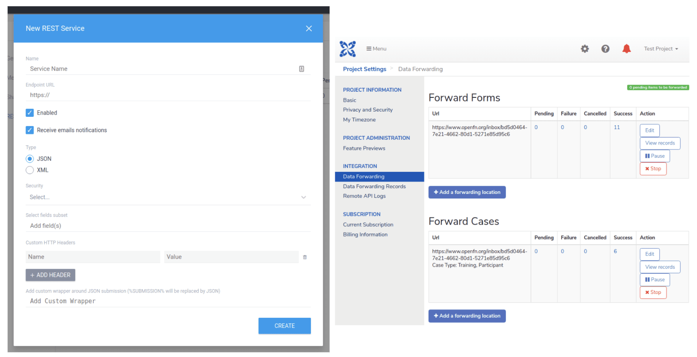

(this is a test)
## Standard webhook configuration

This section describes how to enable push notifications from selected source
applications or how to configure pull jobs to fetch data from those sources. If
you don't see yours in the alphabetical list below feel free to add it with a
pull request.

Every OpenFn project has a unique **Inbox URL** address that can be used as an
endpoint for any JSON webhook. To set up a data source, configure that source to
make a POST over HTTPS to your Inbox URL. See [Your Inbox](/build/inbox.md).

To connect an application with standard JSON webhooks, copy your inbox URL from
the "Inbox" page or your "Project Settings" screen and use it as the destination
URL on your source application. Unless you have specifically configured it on
the "Access & Security" page, no authentication is required.

**_N.B.: This is by no means an exhaustive list._** It is merely a list of
common sources that external contributors have added. Remember that anything
with a REST api or a JSON-based notification service can be used with OpenFn.

 ## How webhooks enable real time integration

Webhooks services (sometimes called “REST Services”) are services that your
users can configure on your application which make posts to other REST
endpoints. The most common example we’ll come across is a form, submission, or
case forwarding service that will send a copy of a submission to an external
API.

## Providing a UI for your webhook?

This is likely the most end-user interactive part of your API, and you’ll
probably want a feature in your user-interface that allows them to turn on and
off these various services. See the below example from Kobo Toolbox (left) and
CommCare (right).

## When to send?

Consider whether to set up watches or triggers at the DB level (this seems like
overkill but is provided by some databases relatively inexpensively) or at
several key interfaces in your application. What types of
updates/submissions/changes in your application might other applications need to
be notified of in real time? A new submission is the most common, but updates to
a “case”, changes to UAM, or any other events could be valuable.

## What to send?

The whole resource, please. This anticipates our thoughts on sector-wide data
standards slightly, but (within reason) it makes sense to expose everything your
end-user will need to run the next step in their logic. Some interfaces allow
the user to control which fields (and even which related resources) are sent in
a given payload, but often the default is to send everything and let them pick
and choose what they want to use.

